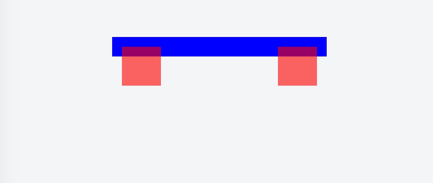

## 前言
最近来了一个实习的小伙，由于项目也比较紧，不可能把现有的业务交给他一个新手，于是老大突发奇想弄了一个罗列bug list的小项目给他做，上手挺快的，基本雏形都做的七七八八了，突然有天跑过来跟我说出问题了，说样式崩了，有个容器怎么也撑不开，缩进去了？看了一眼代码，跟我想的一样，float惹的祸。

float这东西，刚开始用的时候觉得挺好用的，布局很方便呀，但我刚入门的时候就有人提醒我说少用float，坑很多。后来为了彻底弄懂这些坑也做了不少研究，今天就拿出来分享分享。

## 问题
我们来看下面这段代码：
```html
<div class="parent">
  <div class="child-left"></div>
  <div class="child-right"></div>
</div>
```
```css
.parent{
  width:200px;
  margin:40px auto;
  padding:10px;
  background:blue;
}
[class^='child']{
  width:40px;
  height:40px;
  background:red;
  opacity:0.6;
}
.child-left{
  float:left;
}
.child-right{
  float:right;
}
```
最终显示：


我们蓝色背景的父级容器，里面有两个子元素，按照盒子模型的原理，块级子元素应当可以撑开父级元素的高度，但是这里并没有。造成这个现象的原因是因为我们在子元素中定义了float浮动的样式，导致父元素无法被撑起，也就是我们常说的父元素塌陷。

### float定义
float 属性定义元素在哪个方向浮动。以往这个属性总应用于图像，使文本围绕在图像周围，不过在 CSS 中，任何元素都可以浮动。浮动元素会生成一个块级框，而不论它本身是何种元素。

如果浮动非替换元素，则要指定一个明确的宽度；否则，它们会尽可能地窄。

**注释**：假如在一行之上只有极少的空间可供浮动元素，那么这个元素会跳至下一行，这个过程会持续到某一行拥有足够的空间为止。

我认为这里改为**float属性定义元素尽可能向哪个方向浮动**更为合适。这里的尽可能指的是元素会一直平移到所处容器的边框，或者是碰到另一个浮动元素。浮动元素最远的浮动距离是其所处容器的边框，所以我们可以看到上文代码中红色方框设置浮动后并没有超过蓝色的左右边框。（你可以将padding设为：padding:5px 0;试试哦）

我们再来看另一种说法：**float元素会脱离文档流**。很多书籍上都是这么写的，但这样的定义其实并不严谨，给许多刚开始的前端程序员造成了不少困扰，个人认为正确说法是**float元素会相对脱离文档流**，因为它仍然保持部分的流动性，那么有绝对脱离文档流的元素么？有，position设置为absolute，fixed的元素就是绝对脱离文档流的。其相对指的就是父元素。

文档流，文本流傻傻分不清？<a href="http://www.cnblogs.com/gvip-cyl/p/6258119.html" title="flowtips">点这里</a>

## 原因

既然问题更float元素的定义都给了出来了，那么就要开始分析造成上面父元素塌陷的原因了，其实上面已经解释了。

其实就是因为float元素（相对）脱离了文档流造成的。html文档加载解析时是从上到下，从左到右的，浮动元素脱离文档流后就不受文档流的管辖了，这就导致它存在父元素的高度随着浮动被抹去了，父元素也默认无视了这个浮动元素，上文代码中除浮动元素外没有其他元素，所以就会出现上面的父元素塌陷的问题。

## clear属性造成的困扰

clear属性的官方定义是：规定元素的哪一侧不允许其他浮动元素。注意这里清除并不是清除float元素的效果，也不是清除float元素造成塌陷的结果，我见过有人将clear写在父元素上结果喊着说clear欺骗了他（没错，就是我）。

clear属性只是规定了拥有该属性的元素两侧的浮动元素不会对它造成影响，什么意思？再看段代码

```html
<div class="parent">
  <div class="child-first"></div>
  <div class="child-second"></div>
</div>
```
```css
.parent{
  width:200px;
  margin:40px auto;
  padding:10px;
  background:blue;
}
[class^='child']{
  float:left;
  width:40px;
  height:40px;
  background:red;
  opacity:0.6;
}

.child-second{
  clear:both;
}
```

我们在第二子元素child-second上添加了clear:both;属性,这时第二个子元素并没有挨着第一个浮动的子元素排列，而是像块级元素一样(float清除了div中块级元素的特性)展示到了下一行。但是它并没有撑开父元素，也没有改变其他子元素的排列。

clear属性**只影响使用这个属性的元素本身，不影响其他元素。** 所以在浮动元素或者父元素上利用clear属性来解决塌陷问题不成立的，因为无论你是加在父元素还是子元素上，都对其他元素没有任何影响。(但clear确实可以解决塌陷问题，下面就给出正确答案)


## 解决
我们想要达成的结果是，既保持浮动的效果，又能解决浮动导致的塌陷问题。

分别先给出解决方案，再解释原因。我们还是第一个例子的基础上做实验。

1. 添加额外标签
```html
<div class="parent">
  <div class="child-left"></div>
  <div class="child-right"></div>
  <div style="clear:both;"></div>
</div>
```

我们发现


